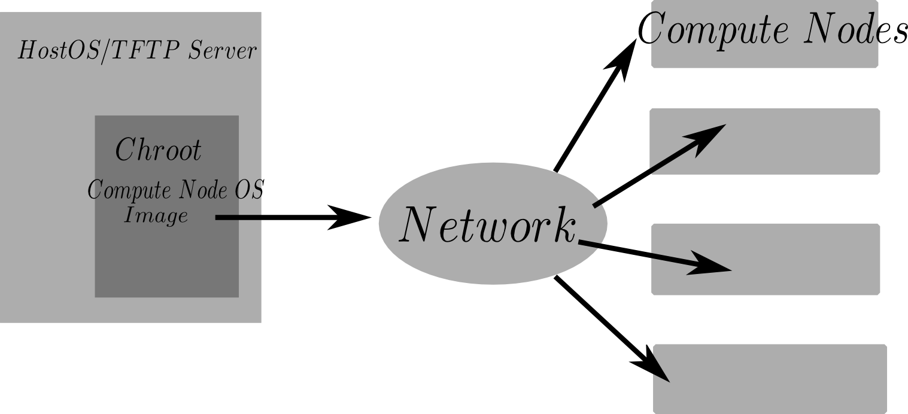

Head Node OS Install
++++++++++++++++++++

When installing Debian on the head node, take care to configure the raid 10 correctly, utilizing all drives in a single mdraid storage pool.
A recommended raid 10 + LVM setup is shown below.  Logical Volume Management (LVM) is useful when creating backup snapshots or resizing partitions.::

    -------------------------------------------------------------
    |                       RAID 10 Array                       |
    | Disk 1 (sda) | Disk 2 (sdb) | Disk 3 (sdc) | Disk 4 (sdd) | <- config each divice as RAID device
    -------------------------------------------------------------
    |                           LVM                             | <- Use entire raid10 in LVM pool
    -------------------------------------------------------------
    | LVM locigal vol "home"            | LVM logical vol "root"| <- LVM logical volumes
    -------------------------------------------------------------
    |          /home   (~1.5Tb)         |           / (~0.5Tb)  | <- fs mounts
    -------------------------------------------------------------

.. Note::

    Ensure to mark _atleast_ one disk with a "bootable" flag durring the partitioning step.
    As of the time of this writing (fall 2015) grub can boot from the /boot directory located 
    inside a raid 10 array.  No need to make a seperate /boot partition.

The Debian installations will ask
for a new user to be setup  (in addition to the root account).  This user should be the default
system administration account.  

.. Note::
    The administrators account is NOT the root account.  We will dissallow root login from the 
    outside world to the cluster in future steps.  When first logging in as an admin 
    you must switch users to the root account to make modifications
    to the base system.  Installing sudo and adding admin users to the sudo group aliviates some
    minor annoyances of having to type "su" all the time.

Durring the install procedure, there will be an option to install some software packages.  They are
all optional, however, it is recommended to install the ssh package and disable any "printer" packages.
It is not neccisary to install a graphical desktop environment - it will only consume hard drive space but has no
other consequences.  

From here on, every command that is
executed as root will have a ``#`` symbol preceeding it.  Every command that is executed
by a limited privilage account will be preceeded by a ``$``.

If no graphical desktop environment package was selected durring the initial instal, you can choose to install a minimal
gui desktop environment after you boot the new head node OS for the first time.
X11, a basic web browser such as Madori and a simple destop environment should be installed on the head node. ::

    # apt-get update
    # apt-get install Xorg madori dwm

If dwm is installed, the contensts of ``$~/.xinitrc`` should contain. ::

    exec dwm &

The graphical environment is lauched by ::
    
    $startx

This will allow easy graphical configuration of the Firewall in the following steps. Avoid running X11 as root. The
user should learn the basic commands of dwm before use.  Dwm is a minimal desktop window manager.  Read Dwm's documentation
for details on how to resize windows, open a terminal (super + enter), or launch applications (super + p or super + space by default).

.. note::
    It is not known at this time if infiniband will be useded for interconnects or not.  It may be very expensive
    to buy the networking equipment to do so.  IF you are so lucky to have infiniband interconnects you should install
    IPoIB (IP over Infiniband) on the head node and storage nodes.  This will allow the infiniband LAN to
    be managed just like an ethernet network.

Configure Head Node
++++++++++++++++++++

These steps are to be executed after a fresh install of Debian Linux is made on the head node.

The following image illustrates the setup we are working towards:

Become root ::

    $su -

Update ``/etc/hosts``.  Ensure this file contains all IPs and hostnames of all nodes ::

    192.168.1.101  nukestar01
    192.168.1.102  nukestar02
    192.168.1.103  nukestar03
    192.168.1.104  nukestar04
    192.168.1.105  nukestar05
    192.168.1.106 nukestar06

Install prerequisite software ::

    #apt-get update
    #apt-get install tftpd-hpa nfs-kernel-server debootstrap syslinux ssh nfs-common pxelinux ntp

Make root rsa ssh key pair ::
  
    #cd /root
    #ssh-keygen -t rsa

do not set a password when propted (password-less key based login will be used).

Setup Chroot
-------------

Make a chroot root dir and chroot home dir.  Debootstrap install into /srv/nukeroot directory. ::
   
    #mkdir /srv/nukeroot /home/srv/nukehome 
    #debootstrap jessie /srv/nukeroot http://http.debian.net/debian

Update ``/etc/fstab`` on host OS ::

    #echo "/home/srv/nukehome /srv/nukeroot/home bind defaults,bind 0 0" >> /etc/fstab
    #echo "/dev /srv/nukeroot/dev auto bind 0 0" >> /etc/fstab
    #echo "/dev/pts /srv/nukeroot/dev/pts auto bind  0 0" >> /etc/fstab
    #mount -a

Configure Chroot
-----------------

Place the contents of the base OS root public ssh key: ``/root/.ssh/id_rsa.pub`` 
in the chroot ``/srv/nukeroot/root/.ssh/authorized_keys`` file.  Make the
``/srv/nukeroot/root/.ssh/authorized_keys`` file if it does not exist.

.. Note::

   This is required for the Ansible scripts to work properly.  Ansible relies on communication over ssh.
   If you do not want to use the ansible scripts, then ignore.

chroot ::

    #chroot /srv/nukeroot

All chroot commands will be preceeded with ``#>``.

Clear contents of ``#>/etc/hostname`` because hostname will be obained from DHCP server.

Enable non-free package repo. Edit ``#>/etc/apt/sources.list`` so it contains ::

    deb http://http.debian.net/debian jessie main non-free 

Install base packages in chroot environment ::

    #>apt-get update
    #>apt-get install aufs-tools nfs-client linux-image-3.16.0-4-amd64 vim ntp
              initramfs-tools locales dialog build-essential firmware-bnx2

.. Note::

   the firmware-bnx2 package contains NIC drivers for the Dell blades used in the
   current cluster.  You should identify which NIC drivers are needed for your perticular hardware.
   It is very important to get the proper NIC drivers installed in the chroot because they will
   be cooked into the iso that is distributed to the compute nodes on PXE boot.  If the proper
   NIC driver is not avalible on the iso, the network interface on the compute nodes will obviously 
   not work and the compute nodes will fail to boot.

... Note::
   
   The linux-image package version will change depending on what version of Debian is being run.
   3.16.0-4-amd64 is the version packaged with debian "jessie" (8.2).

Generate root ssh keys in chroot ::
  
    #>cd /root
    #>ssh-keygen -t rsa

Update ``#>/etc/hosts``.  Ensure this file contains all IPs and hostnames of all nodes ::

    192.168.1.101  nukestar01
    192.168.1.102  nukestar02
    192.168.1.103  nukestar03
    192.168.1.104  nukestar04
    192.168.1.105  nukestar05
    192.168.1.106 nukestar06

Update ``#>/etc/fstab`` in chroot ::

    #>echo "nukestar01:/home/srv/nukehome /home nfs noatime 0 0" >> /etc/fstab

Generate locales ::

    #>locale-gen en_US.UTF-8

Configure initramfs. Ensure the following lines exists in 
``#>/etc/initramfs-tools/initramfs.conf``::

    BOOT=nfs
    DEVICE=eth0

.. Note::
    
    The  compute network device name (eth0 in this example) may be subject to change depending on a variety of
    hardware factors.   

Create initrd image ::

    #> mkinitramfs -o initrd.image.netboot

Configure overlay file system script.  Aufs allows local changes to be
stored in ram on the diskless clients ::

    #> echo aufs >> /etc/initramfs-tools/modules
    #> vim /etc/initramfs-tools/scripts/init-bottom/aufs

Fill with the following ::

    modprobe aufs
    mkdir /ro /rw /aufs
    mount -t tmpfs tmpfs /rw -o noatime,mode=0755
    mount --move $rootmnt /ro
    mount -t aufs aufs /aufs -o noatime,dirs=/rw:/ro=ro
    mkdir -p /aufs/rw /aufs/ro
    mount --move /ro /aufs/ro
    mount --move /rw /aufs/rw
    mount --move /aufs /root
    exit 0

Make executable ::

    #> chmod +x /etc/initramfs-tools/scripts/init-bottom/aufs

Update boot image ::

    #> update-initramfs -u

Set a root password ::

    #> passwd root

Exit chroot ::

    #> exit

Copy contents of chroot root pub ssh key ``/srv/nukeroot/root/.ssh/id_rsa.pub`` to the
base OS root ``/root/.ssh/authorized_keys`` file.

TFTP and PXE boot Setup
------------------------

Back on the head node copy boot image to ``/srv/tftp`` ::

    # mkdir /srv/tftp
    # cp /srv/nukeroot/boot/initrd.img* /srv/tftp/.
    # cp /srv/nukeroot/boot/vmlinuz-* /srv/tftp/.
    # cp /usr/lib/PXELINUX/pxelinux.0 /srv/tftp/.

.. Note::

     the location of pxelinux.0 may change depending on the distribution. See specific distribution
     notes on where pxelinux.0 will be placed by the syslinux or pxelinux package.

Configure PXE ::

    # mkdir /srv/tftp/pxelinux.cfg

Fill ``#/srv/tftp/pxelinux.cfg/default`` with ::

    default Debian
    prompt 1
    timeout 5
    label Debian
    kernel vmlinuz-<name_of_image>
    append ro initrd=initrd.img-<name_of_image> root=/dev/nfs ip=dhcp nfsroot=stor01:/nukeroot

.. Note::
   
    where <name_of_image> may be something like "3.16.0-4-amd64".  See filename of
    /srv/nukeroot/boot/vmlinuz-*

Fill ``#/etc/default/tftpd-hpa`` with the following ::

    TFTP_USERNAME = "tftp"
    TFTP_DIRECTORY = "/srv/nukeroot"
    TFTP_ADDRESS = "0.0.0.0:69"
    TFTP_OPTIONS = "--secure"

Restart tftpd-hpa ::

    #/etc/init.d/tftpd-hpa restart

Edit ``#/etc/exports`` file to contain NFS export details ::

    /srv/nukeroot  192.168.1.102(ro,no_root_squash,async,insecure,no_subtree_check) \
    192.168.1.103(ro,no_root_squash,async,insecure,no_subtree_check) \
    192.168.1.104(ro,no_root_squash,async,insecure,no_subtree_check) \
    192.168.1.105(ro,no_root_squash,async,insecure,no_subtree_check) \
    192.168.1.106(ro,no_root_squash,async,insecure,no_subtree_check)
    #
    /home/srv/nukehome  192.168.1.102(rw,no_root_squash,async,insecure,no_subtree_check) \
    /home/srv/nukehome 192.168.1.103(rw,no_root_squash,async,insecure,no_subtree_check) \
    /home/srv/nukehome 192.168.1.104(rw,no_root_squash,async,insecure,no_subtree_check) \
    /home/srv/nukehome 192.168.1.105(rw,no_root_squash,async,insecure,no_subtree_check) \
    /home/srv/nukehome 192.168.1.106(rw,no_root_squash,async,insecure,no_subtree_check)
     
Run ::

    #exportfs -ra

You can now configure the compute nodes' to network boot via their bios menus.  Typically, the option to PXE (or network) boot
exists in the boot menu.  All other boot options can be disabled.  Once configured,  boot up all the compute nodes
and enjoy stateless node convinience!

